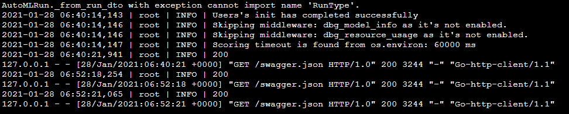

# Azure ML Operations
We look into deploying AzureML model and pipeline as endpoints in this project.  One of the main benefits of deploying a model endpoint is that other applications can use the model for inference through REST API calls, which will be universally available when there is an internet connection.

The pipeline endpoint also simplifies the process of re-training a new model based on dataset updates.  With an API call, the pipeline will perform tasks from ingesting the updated datasets, running AutoML experiments, and all the way to deploying the best model.  In this project, we implement a platform for automating the machine learning process.

## Future Improvements
In this project, we deployed the pipeline endpoint so that REST API calls can be used to trigger model re-training.  But how about the dataset for model re-training?  From internet search, I learned that Azure provides the `ModelDataCollector` class to enable collection of the production data used for calling a model endpoint.  If the time permits, I'd like to try this data collection feature and include it in the pipeline for model re-training.

## Architectural Diagram

## Key Steps
*TODO*: Write a short discription of the key steps. Remeber to include all the screenshots required to demonstrate key steps. 

- Register dataset so that it can be used by AzureML  
  
  
- Run AutoML experiment to determine the best model  
  
  - find the best model after experiment is done  
  

- Deploy the best model as an endpoint and enable its Application Insights

  - The logs of the endpoint can also be retrieved by Azure SDK  
  
  - Look up the available REST API call format from swagger.json in the "Swagger URI"  
  
  - Here is the sample payload of the POST call  
  
  - Sample response from a POST call to the model endpoint  
  
  - (Optional) We can use Apache Benchmark to check the performance of the endpoint  
    
  

- Create an Azure Pipeline to automate model training and evaluation  

- Publish the above pipeline as an endpoint  
  
  - The published pipeline has a REST endpoint  
    
  - The published pipeline can be triggered by REST API calls  
  

## Screen Recording
Here is a link to the screencast that demos the deployment of model and pipeline: https://youtu.be/nseYZrQHdEo

## Standout Suggestions
*TODO (Optional):* This is where you can provide information about any standout suggestions that you have attempted.

